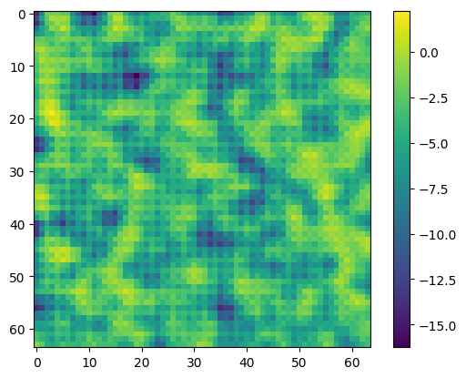

# FluidDiff

This repository contains an implementation of **FluidDiff**, a diffusion-based model for fluid dynamics.  
The project includes dataset generation, model training, and example usage.  
Original paper: [link to the article](https://arxiv.org/pdf/2301.11661)  

---

## 📂 Repository Structure

- **`FluidDiff.py`** — core implementation of the FluidDiff model (can be imported as a module).  
- **`FluidDiff_dataset.ipynb`** — dataset generation using [PhiFlow](https://github.com/tum-pbs/PhiFlow).  
- **`FluidDiff_train.ipynb`** — training notebook for the FluidDiff model.  
- **`example.py`** — minimal example of model inference.  
- **`example_data.npy`** — example dataset used for testing and inference.  
- **`weights.40.weights.h5`** — trained model weights after 40 epochs.  

---

📌 Notes

Designed for fluid field simulations (e.g., velocity, pressure).

Trained on synthetic data generated with PhiFlow.

Achieved MAE = 0.1 after 40 epochs.

To predict future condition of fluid use `ddm.generate(n, diffusion_time, data)`, 
where `n` is amount of batches, `diffusion_time` is amount of diffusion steps during
sampling, `data` is TensorFlow Tensor (shape = (N, 64, 64, 4), where N is number of pictures,
the first and the second channels should be Noise, the third one - ρ(0), the fourth one - 
64x64 matrix where each element = t/40 (t can be 1,...40; in fact it's simulation time))
## Example Generation

Below is an example of FluidDiff denoising a fluid field:

## Architecture

